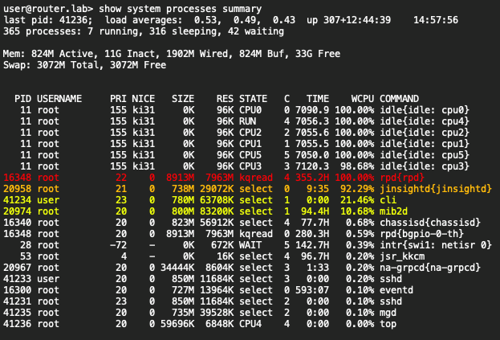
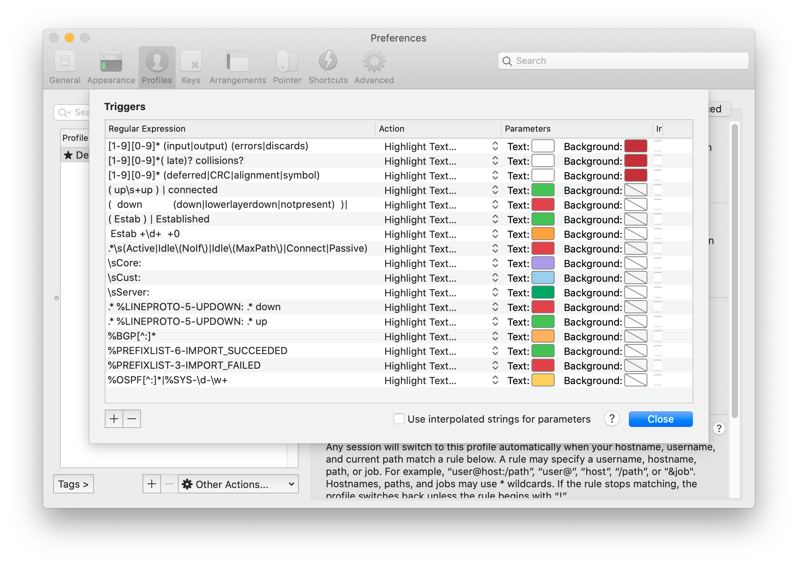
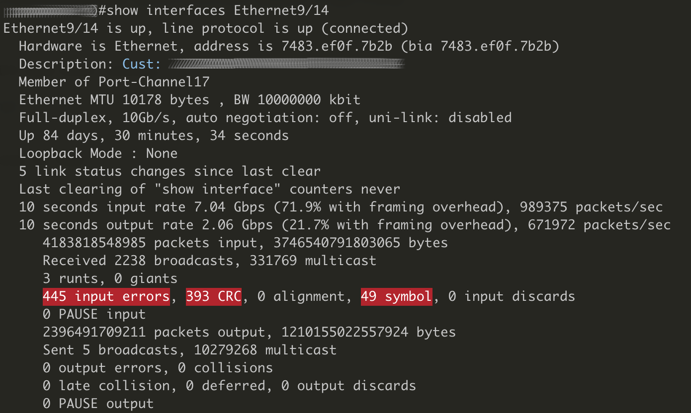
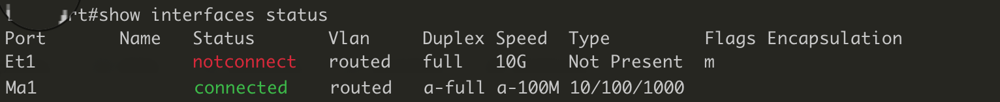
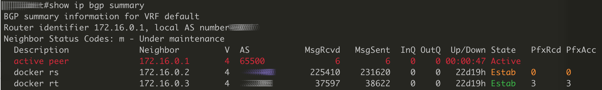
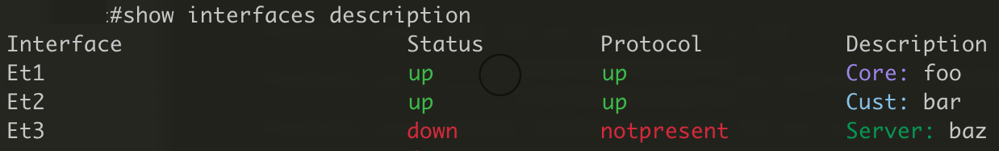
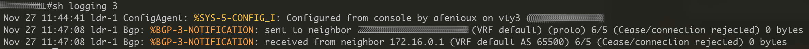

# iterm2-triggers

[iTerm2](https://iterm2.com) is a replacement for Terminal and the successor to iTerm. It works on Macs with macOS 10.14 or newer.
It allows you to create Triggers. Triggers watch for text matching a regluar expression to arrive in a terminal session and then perform an action in response.

You can import triggers from a file/profile but you can configure them on "Preferences, Profile, Advanced, Edit Triggers".

The whole options are detailed in the [official documentation for triggers](https://iterm2.com/triggers.html).


# Helpful regex triggers for iTerm2.

## Juniper Junos specific triggers

#### Highlight processes using CPU

These triggers will spot process using too much CPU on a Junos device. See screenshot below.  

Processes using 100% CPU are highlighted in RED

Processes using between 60.00% and 99.99% are highlighted in ORANGE

Processes using between 10.00% and 59.99% CPU are highlighted in YELLOW



Below the regexp to use in order to achieve that :  

Spot 100% CPU : `\d{1,5} [a-z]+.*[MKG].*100.00% (?!idle).*` Highlight text in RED  

Spot 60.00%-99.99% CPU `\d{1,5} [a-z]+.*[MKG].*(6|7|8|9)\d\.\d\d\% (?!idle).*` Highlight text in ORANGE  

Spot 10.00%-59.99% CPU`\d{1,5} [a-z]+.*[MKG].*(1|2|3|4|5)\d\.\d\d\% (?!idle).*` Hightlight text in YELLOW  


See triggers screenshot below :


## Arista EOS specific triggers
There triggers may also works on Cisco IOSes with some minor tunning.




### errors on interface

These regexp have been split to 3 lines to be easy to read
```
[1-9][0-9]* (input|output) (errors|discards)
[1-9][0-9]*( late)? collisions?
[1-9][0-9]* (deferred|CRC|alignment|symbol)
```
Background in red, text in white.


### interface status


`( up\s+up ) | connected ` Highlight text in green.  
`(  down           (down|lowerlayerdown|notpresent)  )| notconnect | errdisabled ` Highlight text in red.


### BGP sessions status


`( Estab ) | Established` Highlight text in green when bgp session is established.  
` Estab +\d+  +0` Highlight text in orange when bgp session is established and no route is received.  
`.*\s(Active|Idle\(NoIf\)|Idle\(MaxPath\)|Connect|Passive)\s*$` Highlight all the line in red when bgp session is not established. 


### interface description
If you are using observium syntax...



`\sCore:` Highlight text in violet.  
`\sCust:` Highlight text in blue.  
`\sServer:` Highlight text in green.  

### logging
Set colors on logs lines/patterns



```
.* %LINEPROTO-5-UPDOWN: .* down
.* %LINEPROTO-5-UPDOWN: .* down
%BGP[^:]*
%PREFIXLIST-6-IMPORT_SUCCEEDED
%PREFIXLIST-3-IMPORT_FAILED
%OSPF[^:]*|%SYS-\d-\w+
```
