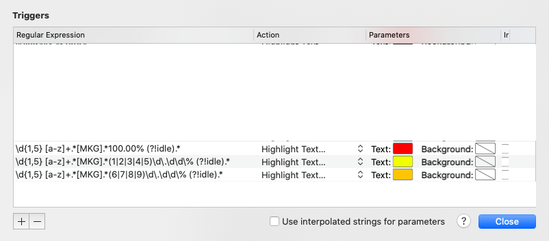

# iterm2-triggers

Helpful regex triggers for iTerm2

## Juniper Junos specific triggers

#### Highlight processes using CPU

These triggers will spot process using too much CPU on a Junos device. See screenshot below.  

Processes using 100% CPU are highlighted in RED

Processes using between 60.00% and 99.99% are highlighted in ORANGE

Processes using between 10.00% and 59.99% CPU are highlighted in YELLOW

Below the regexp to use in order to achieve that :  

Sport 100% CPU : `\d{1,5} [a-z]+.*[MKG].*100.00% (?!idle).*` Highlight text in RED  

Spot 60.00%-99.99% CPU `\d{1,5} [a-z]+.*[MKG].*(6|7|8|9)\d\.\d\d\% (?!idle).*` Highlight text in ORANGE  

Spot 10.00%-59.99% CPU`\d{1,5} [a-z]+.*[MKG].*(1|2|3|4|5)\d\.\d\d\% (?!idle).*` Hightlight text in YELLOW  

See triggers screenshot below :

